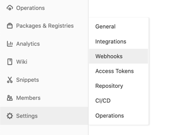
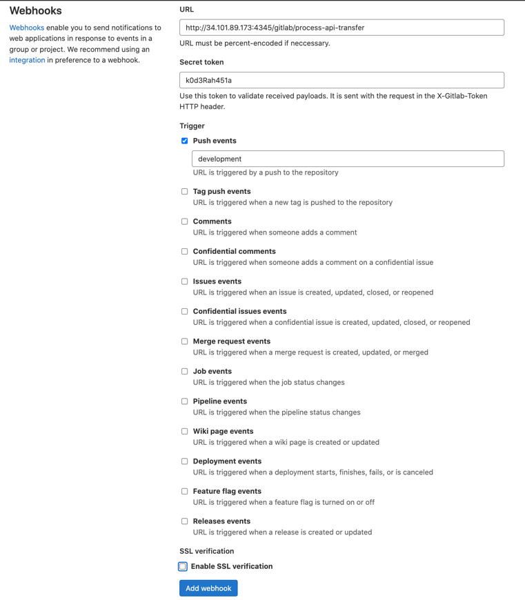
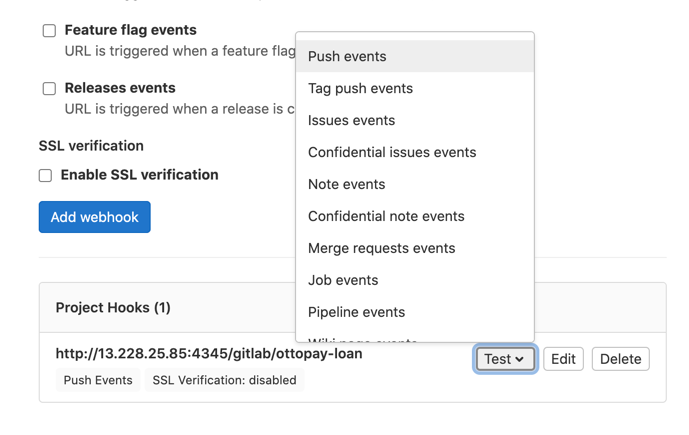

# Gitlab Webhook Receiver

Do whatever you want after receiving a webhook from gitlab

## Setup
To setup this project use this step below

### Run Project
1. Clone repository https://andromeda.ottopay.id/zaky/gitlab-webhook
2. Copy config/conf.go.example to config/conf.go
3. Buka file config/conf.go dan sesuaikan. Config Appname dan Token ini akan disesuaikan pada step berikutnya
4. Untuk path, pada config digunakan untuk menyimpan informasi path dari projectnya
5. Untuk command, digunakan untuk menyimpan informasi apa saja yang akan di jalankan setelah menerima webhook
6. Untuk user, diusahakan sama pengan user yang dipakai untuk menjalankan aplikasi maupun service
7. Untuk dicord webhook, berisi dengan url discord untuk notifikasi jika aplikasi menerima webhook.
Untuk tutorial cara mendapatkan url discord bisa melihat [di sini](https://help.dashe.io/en/articles/2521940-how-to-create-a-discord-webhook-url)

Ini contoh full confignya pada file `config/conf.go`

```go
// Get ..
func Get(appname string) (*GitlabConfig, error) {
	switch appname {
	case "ottopay-loan":
		return &GitlabConfig{
			Appname: "Ottopay/ottopay-loan",
			Token:   "k0d3Rah451a",
			Path:    "/Users/zakyyudha/go/src/ottopay-loan",
			Command: []string{
				fmt.Sprintf("%v pull origin development 2>&1", GetGitLocation()),
			},
			User:         GetUser(),
			DiscordWebhook: "https://discord.com/api/webhooks/877918990863839242/mwLPaOck3fzFmDBn8kA05wJRmrqVTVVKsa_bDseNLonW58Ey8nwJbMXKDi-KWCDuewP",
		}, nil
		
	// Jika ingin menambahkan aplikasi lain untuk auto deploy, tambahkan kondisi `case` pada logic
	//case "some-other-application":
	//	return &GitlabConfig{
	//		Appname: "some-other-application",
	//		Token:   "some-other-token",
	//		Path:    "some-other-path",
	//		Command: []string{
	//			fmt.Sprintf("%v pull origin development 2>&1", GetGitLocation()),
	//          fmt.Sprintf("some other command")
	//		},
	//		User:         GetUser(),
	//		DiscordWebhook: "some-other-discord-webhook",
	//	}, nil
	
	default:
		return nil, errors.New("app " + appname + " not registered")
	}
}
```
8. Jalankan start.sh

### Create Gitlab Webhook
9. Pilih menu settings pada gitlab project repository kemudian pilih webhooks

10. Isi url dengan format {{host_server}}/gitlab/:appname (contoh: http://34.101.89.173:4345/gitlab/process-api-transfer) 
apname ini akan digunakan pada `config.go` step nomor 3
11. Isi secret token bebas apa saja (contoh: k0d3Rah451a) token ini yang akan digunakan pada `config.go` step nomor 3
12. centang push events dan masukan branch yang ingin di deploy otomatis pada environment dev (contoh: dev)
13. Jangan centang enable ssh verification

14. Tekan tombol add webhook
15. Selesai, aplikasi akan otomatis terdeploy pada server 🍻

### Test
16. Klik tombol test, kemudian pilih push event.


## Version
- 1.0
